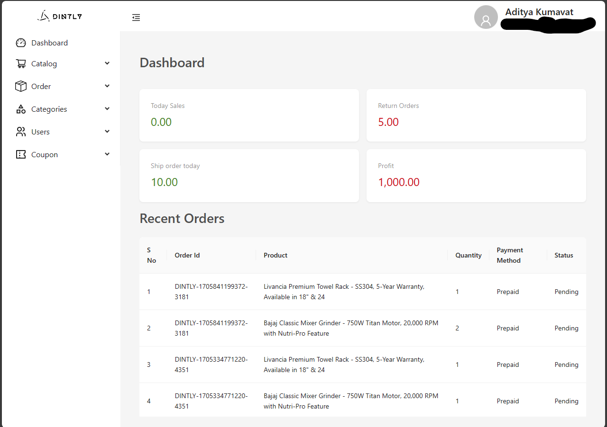
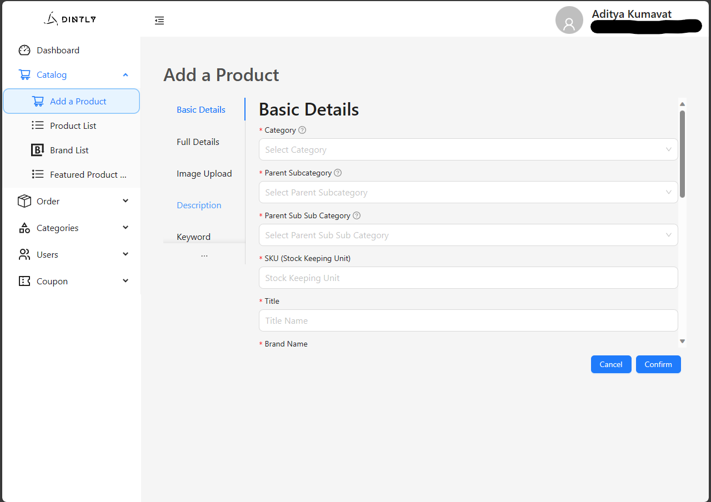
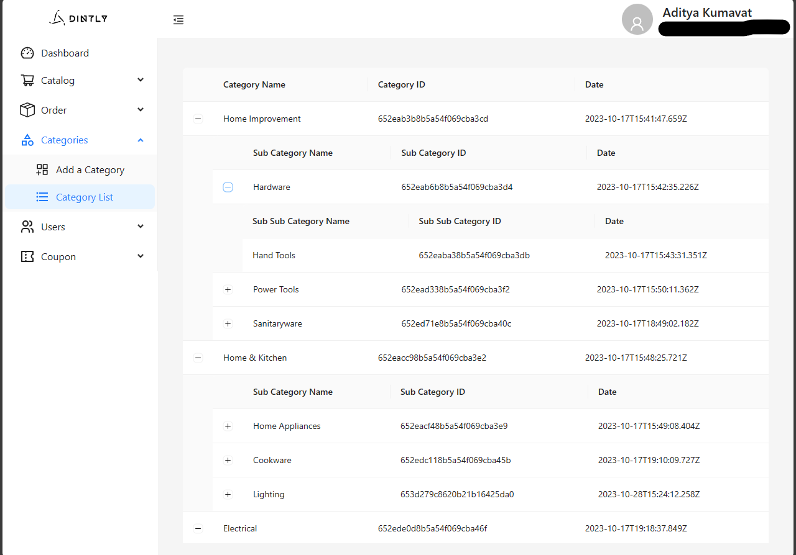

# K-Store Admin Panel
Introduction
K-Store Admin Panel is a comprehensive e-commerce administration platform designed to streamline and manage the backend operations of an online store. This robust panel allows administrators to efficiently handle products, coupons, categories, orders, returns, and user management with ease.

# Features
CRUD Operations for Products: Create, Read, Update, and Delete products easily.
Coupon Management: Create and manage discount coupons.
Category Management: Organize products into categories for easier navigation.
Order Processing: Streamline the process of managing and fulfilling orders.
Return Order Processing: Handle returns and refunds effectively.
User Management: Manage user accounts and access permissions.
Technology Stack
Frontend
React JS: A JavaScript library for building user interfaces.
Ant Design: A UI design language and React UI library.
Axios: A promise-based HTTP client for the browser and Node.js.
Firebase Authentication: For secure user authentication.
Backend
Nest JS: A progressive Node.js framework for building efficient and scalable server-side applications.
MongoDB: A NoSQL database for storing data in a flexible, JSON-like format.
Firebase Authorization: For managing user permissions and access control.
Getting Started
Prerequisites
Node.js
MongoDB
Firebase account

 
 

# Installation
Clone the repository

bash
Copy code
git clone https://github.com/defineSenTinaL/k-store-admin-panel.git
cd k-store-admin-panel
Install dependencies for the server

Copy code
cd backend
npm install
Set up your environment variables

Copy code
Rename .env.example to .env and fill in your details
Run the backend server

Copy code
npm start
Install dependencies for the client

Copy code
cd ../frontend
npm install
Run the React app

Copy code
npm start
Your app should now be running on localhost:3000.

# Contributing
Contributions to the K-Store Admin Panel are welcome! Please read our contributing guidelines for details on how to contribute.
